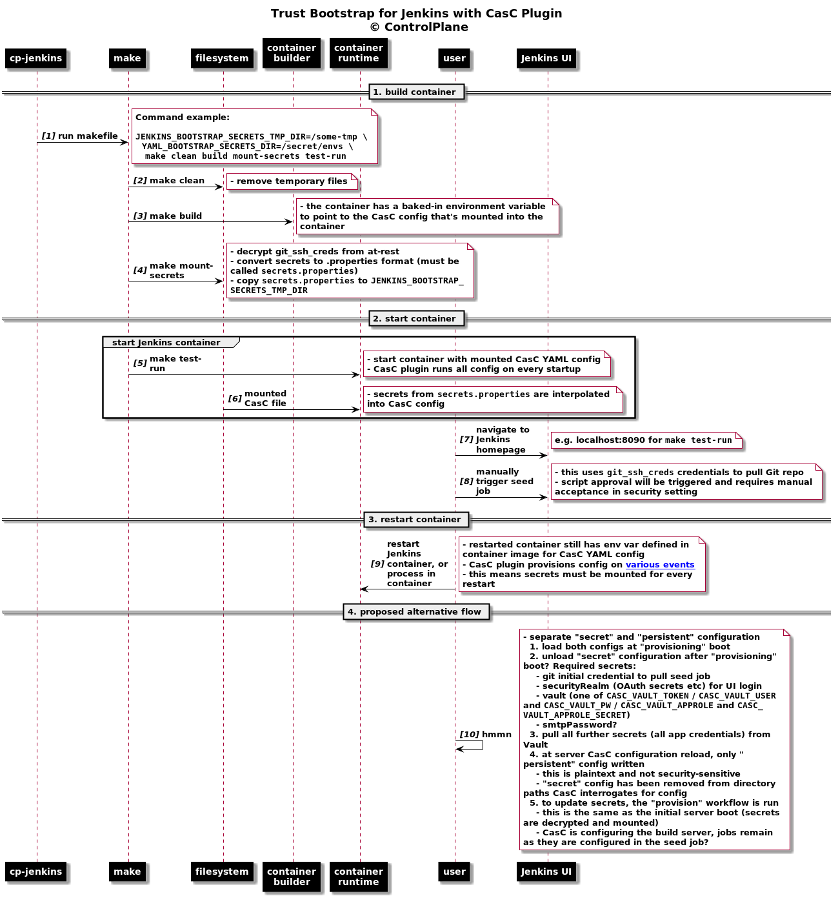

# Jenkins

<!-- toc -->

- [Diagram](#diagram)

<!-- tocstop -->

CasC trust bootstrap starts, reloads, and reconfigures a Jenkins master from scratch. The problem is the secrets must be available in plaintext on the filesystem (in a secrets.properties) for CasC to load them, and when the CasC plugin reloads configuration (which might happen after a plugin update) it tries to rewrite the whole config (and if the plaintext secrets are gone, the Jenkins secrets get "blanked")

Bootstrapping app secrets from Vault requires one of `CASC_VAULT_TOKEN` / `CASC_VAULT_USER` and `CASC_VAULT_PW` / `CASC_VAULT_APPROLE` and `CASC_VAULT_APPROLE_SECRET`, so they need to be injected somehow. Other system secrets (not credentials, general Jenkins secrets) include git init credential, securityRealm (OAuth secrets etc), smtpPassword

My current thinking is to separate the "secret" and "persistent" Jenkins CasC config and merge them in entrypoint magic, then use the Makefile invocation to remove the secrets.properties from the temp filesystem they're mounted into the container on. Any and all thoughts welcome, I'll persevere with this approach for now.

When this is in K8s I don't know how we'll clean up the plaintext secrets yet. Perhaps copying across a shared volume, initContainer magic...urggh.

(The previous way of doing this trust bootstrap in cp-jenkins was to manually set those secrets)

## Diagram

Diagram Source

```puml
@startuml
title Trust Bootstrap for Jenkins with CasC Plugin\n ©️ ControlPlane
skinparam {
  	ArrowColor Black
  	NoteColor Black
  	NoteBackgroundColor White
    LifeLineBorderColor Black
    LifeLineColor Black
  	ParticipantBorderColor Black
    ParticipantBackgroundColor Black
    ParticipantFontColor White
'    defaultFontName Source Code Pro
'    defaultFontSize 25
    defaultFontStyle Bold
    ' wrapping for messages
    maxMessageSize 100
    ' wrapping for notes
    wrapWidth 400
}

== 1. build container ==

autonumber "<i>[0]"


"cp-jenkins"->"make": run makefile
note right
Command example:

""JENKINS_BOOTSTRAP_SECRETS_TMP_DIR=/some-tmp \""
  ""YAML_BOOTSTRAP_SECRETS_DIR=/secret/envs \""
   ""make clean build mount-secrets test-run""
end note

"make"->"filesystem": make clean
note right: - remove temporary files


"make"->"container\nbuilder": make build
note right: - the container has a baked-in environment variable to point to the CasC config that's mounted into the container

"make"->"filesystem": make mount-secrets
note right
- decrypt git_ssh_creds from at-rest
- convert secrets to .properties format (must be called ""secrets.properties"")
- copy ""secrets.properties"" to ""JENKINS_BOOTSTRAP_SECRETS_TMP_DIR""
end note

== 2. start container ==

group start Jenkins container

"make"->"container\nruntime": make test-run
note right: - start container with mounted CasC YAML config\n\
- CasC plugin runs all config on every startup

"filesystem"->"container\nruntime": mounted CasC file
note right: - secrets from ""secrets.properties"" are interpolated into CasC config

end

"user"->"Jenkins UI": navigate to Jenkins homepage
note right: e.g. localhost:8090 for ""make test-run""

"user"->"Jenkins UI": manually trigger seed job
note right
- this uses ""git_ssh_creds"" credentials to pull Git repo
- script approval will be triggered and requires manual acceptance in security setting
end note

== 3. restart container ==

"user"->"container\nruntime": restart Jenkins container, or process in container
note right: - restarted container still has env var defined in container image for CasC YAML config\n\
- CasC plugin provisions config on [[https://github.com/jenkinsci/configuration-as-code-plugin/blob/master/docs/features/configurationReload.md various events]]\n\
- this means secrets must be mounted for every restart

== 4. proposed alternative flow ==

"user"->"user": hmmn
note right
- separate "secret" and "persistent" configuration
  1. load both configs at "provisioning" boot
  2. unload "secret" configuration after "provisioning" boot? Required secrets:
    - git initial credential to pull seed job
    - securityRealm (OAuth secrets etc) for UI login
    - vault (one of ""CASC_VAULT_TOKEN"" / ""CASC_VAULT_USER"" and ""CASC_VAULT_PW"" / ""CASC_VAULT_APPROLE"" and ""CASC_VAULT_APPROLE_SECRET"")
    - smtpPassword?
  3. pull all further secrets (all app credentials) from Vault
  4. at server CasC configuration reload, only "persistent" config written
    - this is plaintext and not security-sensitive
    - "secret" config has been removed from directory paths CasC interrogates for config
  5. to update secrets, the "provision" workflow is run
    - this is the same as the initial server boot (secrets are decrypted and mounted)
    - CasC is configuring the build server, jobs remain as they are configured in the seed job?
end note

@enduml
```

